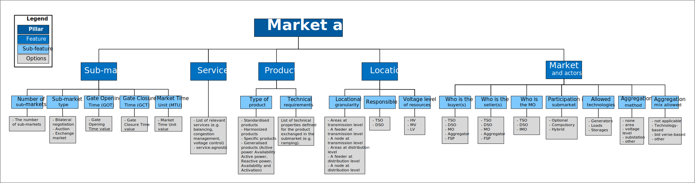

# Theoretical Market Framework
## Theoretical Market Framework overview
The Theoretical Market Framework (TMF) is proposed to analyze existing markets and guide the design and integration of new markets for procuring system services. The TMF helps describe the market architecture through a set of pillars, features, and sub-features, while identifying the corresponding design options.
The TMF comprises five pillars, each with distinct characteristics: (i) overall market architecture, (ii) sub-market coordination, (iii) market optimization, (iv) market operation, and (v) network representation. Some attributes apply across the entire market, explaining sub-market coordination, while others are specific to individual sub-markets. A thorough market design and analysis requires systematically evaluating each pillar and its corresponding attributes for each feature or sub-feature.

## Market architecture pillar
The 'market architecture' pillar encompasses the features that define the overarching characteristics of the market structure as a whole.

## Sub-market coordination pillar
The 'Sub-market coordination' pillar includes features that describe how sub-markets interact, particularly in relation to the allocation of shared resources.

## Market optimization pillar
The ‘Market Optimization’ pillar encompasses the features that determine how a sub-market is cleared and how this clearing process interacts with other sub-markets within the overall market architecture.

## Market operation pillar
The ‘Market Operation’ pillar outlines the features that detail the operational aspects of each sub-market.

## Network representation pillar
The ‘Network Representation’ pillar addresses the properties of the market architecture that specify how and when the network representation is taken into account.

# References

