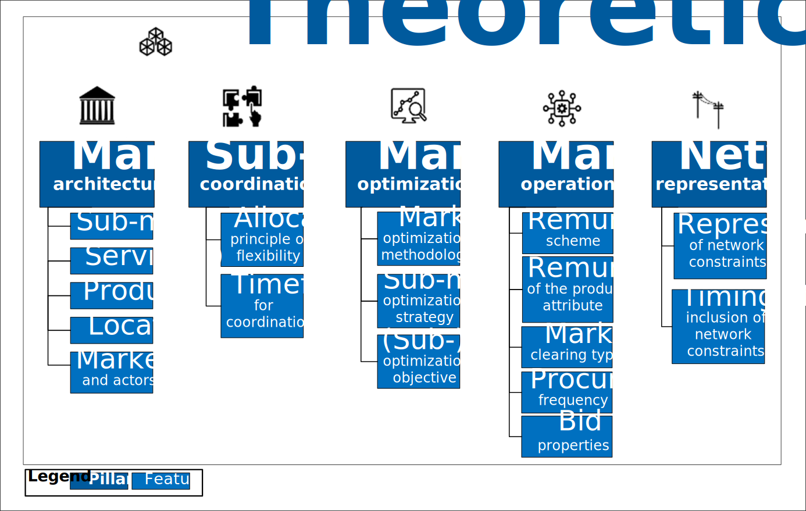
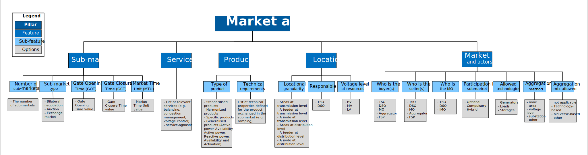
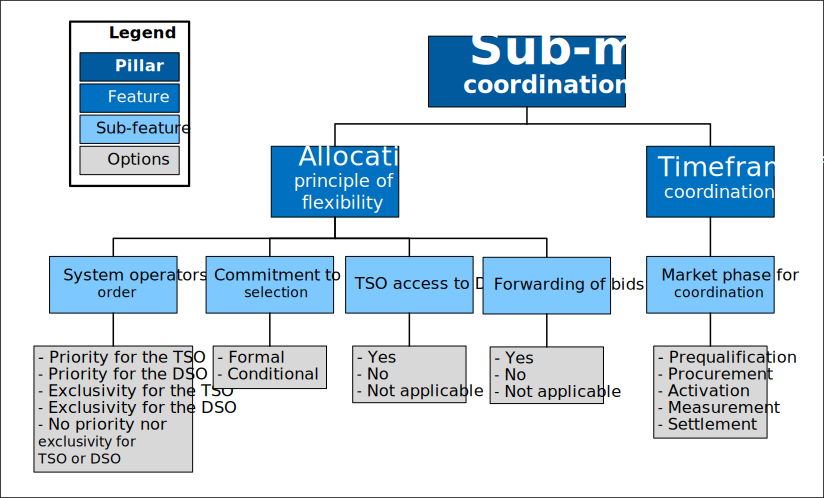
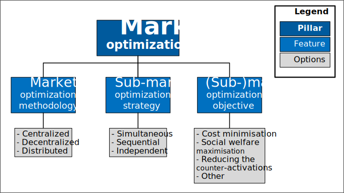
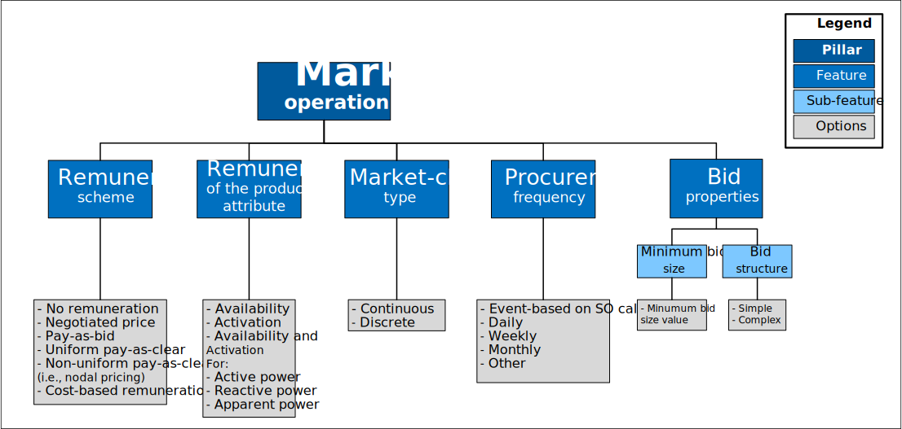
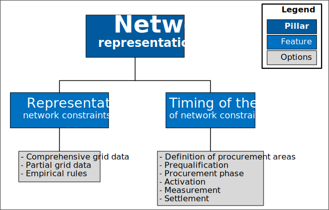

.. Theoretical Market Framework documentation master file, created by
   sphinx-quickstart on Thu Oct  1 20:41:40 2023.

Welcome to Theoretical Market Framework's documentation!
====================================

Theoretical Market Framework (TMF)
====================================

The **Theoretical Market Framework (TMF)** is a tool designed to conceptualize and structure electricity markets while integrating the coordination mechanisms between Transmission System Operators (TSOs) and Distribution System Operators (DSOs). It serves as a comprehensive framework that formalizes innovative market concepts and their effects on existing markets, outlining essential categories and decisions fundamental to market design.

This page provides an overview of the TMF’s structure and its key components.

- Troncia, M., Chaves Ávila, J. P., Damas Silva, C., Gerard, H., & Willeghems, G. (2023). *Market-Based TSO–DSO Coordination: A Comprehensive Theoretical Market Framework and Lessons from Real-World Implementations*. *Energies*, 16(19), 6939. `https://doi.org/10.3390/en16196939 <https://doi.org/10.3390/en16196939>`_  
  
  This paper uses the TMF to tackle the integration challenges associated with new mechanisms for system services. It maps TSO–DSO coordination solutions from 13 European demonstrators, highlighting real-world challenges in designing and implementing innovative system services markets. Based on these insights, the paper provides market design and policy recommendations to address the specific challenges in market-based TSO–DSO coordination.

- Troncia, M., Bindu, S., Chaves Ávila, J. P., Willeghems, G., Gerard, H., & Lacerda, M. (2023). *OneNet Deliverable D11.2 - Techno-economic Assessment of Proposed Market Schemes for Standardized Products D11.2*. `OneNet Deliverable D11.2. <https://www.onenet-project.eu/wp-content/uploads/2024/01/OneNet_D11.2_V1.0.pdf>`_  
  
  This deliverable refines the TMF and illustrates its application to the OneNet demonstrators, describing the bid forwarding capability across different markets within the same market architecture.

- Chaves Ávila, J. P., Troncia, M., Silva, C. D., & Willeghems, G. (2021). *OneNet Deliverable D3.1 - Overview of Market Designs for the Procurement of System Services by DSOs and TSOs*. `OneNet Deliverable D3.1. <https://ec.europa.eu/research/participants/documents/downloadPublic?documentIds=080166e5df2250db&appId=PPGMS>`_  
  
  This document presents the initial proposal of the TMF, including a literature review of frameworks for market analysis and design, along with an in-depth discussion of the conceptual concepts.

The TMF was developed as part of the EU-funded **OneNet Horizon 2020 project** (grant agreement No 957739). 
`OneNet project website. <https://www.onenet-project.eu/>`_  

---------
.. toctree::
   :maxdepth: 2
   .. :caption: Table of Contents

   .. theoretical_market_framework

Theoretical Market Framework
=============================

The Theoretical Market Framework (TMF) is proposed to analyze existing markets and guide the design and integration of new markets for procuring system services. The TMF helps describe the market architecture through a set of pillars, features, and sub-features, while identifying the corresponding design options. 

The TMF comprises five pillars, each with distinct characteristics: (i) overall market architecture, (ii) sub-market coordination, (iii) market optimization, (iv) market operation, and (v) network representation. Some attributes apply across the entire market, explaining sub-market coordination, while others are specific to individual sub-markets. A thorough market design and analysis requires systematically evaluating each pillar and its corresponding attributes for each feature or sub-feature.

Market architecture pillar
---------------------------

The 'market architecture' pillar encompasses the features that define the overarching characteristics of the market structure as a whole.

Sub-market coordination pillar
-------------------------------

The 'Sub-market coordination' pillar includes features that describe how sub-markets interact, particularly in relation to the allocation of shared resources.

Market optimization pillar
---------------------------

The ‘Market Optimization’ pillar encompasses the features that determine how a sub-market is cleared and how this clearing process interacts with other sub-markets within the overall market architecture.

Market operation pillar
-----------------------

The ‘Market Operation’ pillar outlines the features that detail the operational aspects of each sub-market.

Network representation pillar
-------------------------------

The ‘Network Representation’ pillar addresses the properties of the market architecture that specify how and when the network representation is taken into account.

Repository for discussion
==========

We encourage you to join the TMF repository to contribute to the ongoing validation and enhancement of this important framework.
We invite you to engage in discussions, share your insights, and collaborate with us in refining the TMF to align with the evolving demands of the energy sector.
`Theoretical Market Framework Repository <https://github.com/MT-TR/Theoretical_Market_Framework/tree/main>`_  

References
==========

- Troncia, M., Chaves Ávila, J. P., Damas Silva, C., Gerard, H., & Willeghems, G. (2023). *Market-Based TSO–DSO Coordination: A Comprehensive Theoretical Market Framework and Lessons from Real-World Implementations*. *Energies*, 16(19), 6939. (https://doi.org/10.3390/en16196939)
- Troncia, M., Bindu, S., Chaves Ávila, J. P., Willeghems, G., Gerard, H., & Lacerda, M. (2023). *OneNet Deliverable D11.2 - Techno-economic assessment of proposed market schemes for standardized products D11.2*. `OneNet Deliverable D11.2. <https://www.onenet-project.eu/wp-content/uploads/2024/01/OneNet_D11.2_V1.0.pdf>`_
- Chaves Ávila, J. P., Troncia, M., Silva, C. D., & Willeghems, G. (2021). *OneNet Deliverable D3.1 - Overview of market designs for the procurement of system services by DSOs and TSOs*. `OneNet Deliverable D3.1. <https://ec.europa.eu/research/participants/documents/downloadPublic?documentIds=080166e5df2250db&appId=PPGMS>`_

